# Azerbaijan Automotive Market Analysis
## Executive Business Intelligence Report

---

## Executive Summary

This report analyzes **29,775 vehicle listings** from Azerbaijan's leading automotive marketplace, providing strategic insights into market dynamics, pricing trends, and customer behavior. Our analysis reveals critical opportunities for market positioning, inventory optimization, and revenue growth.

### Key Findings at a Glance

- **Market Size**: 29,775 active listings valued at approximately 404 million AZN
- **Average Vehicle Price**: 13,563 AZN (median: 11,200 AZN)
- **Market Concentration**: Baku represents 59.3% of all listings
- **Inventory Age Issue**: 65.7% of vehicles are 15+ years old
- **Feature Adoption Gap**: Only 3.8% offer financing, revealing untapped opportunity

---

## 1. Market Landscape & Competitive Positioning

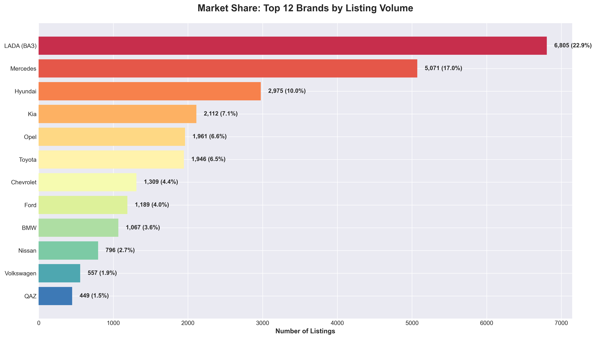

### What This Shows
The market is dominated by budget-to-mid-range brands, with LADA (Russian budget vehicles) commanding nearly a quarter of all listings, followed by Mercedes with 17% market share.

### Business Implications
- **Budget Segment Dominance**: 22.9% of the market consists of LADA vehicles, indicating strong demand for affordable transportation
- **Luxury Opportunity**: Mercedes holds significant share but at surprisingly affordable price points (older models)
- **Market Fragmentation**: Top 3 brands control only 49.9% of market, leaving room for emerging players
- **Korean Advantage**: Hyundai and Kia combined represent 17.1% - strong positioning in the mainstream segment

### Strategic Recommendations
- Target the gap between budget (LADA) and premium (Kia/Hyundai) segments
- Consider the used luxury market where Mercedes maintains strong presence
- Capitalize on brand loyalty among top performers

---

## 2. Price Positioning & Brand Value

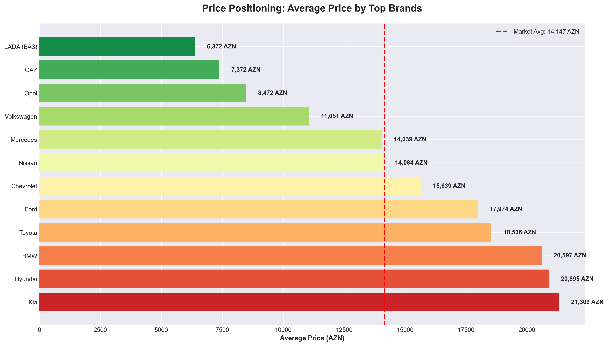

### What This Shows
Korean brands (Kia at 21,309 AZN and Hyundai at 20,895 AZN) command the highest average prices, while LADA averages only 6,372 AZN - a 234% premium for Korean vehicles.

### Business Implications
- **Premium Pricing Leaders**: Kia and Hyundai successfully positioned as premium mainstream brands
- **Value Perception**: Despite luxury status, Mercedes averages only 14,039 AZN due to age of inventory
- **Price Segmentation**: Clear three-tier market structure:
  - **Budget**: LADA, Opel (6,000-8,500 AZN)
  - **Mid-Market**: Mercedes, Nissan, Chevrolet (14,000-16,000 AZN)
  - **Premium Mainstream**: Toyota, Ford, BMW, Kia, Hyundai (18,000-21,000 AZN)

### Strategic Recommendations
- Position new inventory in the underserved 16,000-18,000 AZN range
- Leverage Korean brand premium pricing strategy for revenue optimization
- Consider older luxury vehicles as entry-level premium offerings

---

## 3. Inventory Age Distribution - Critical Finding

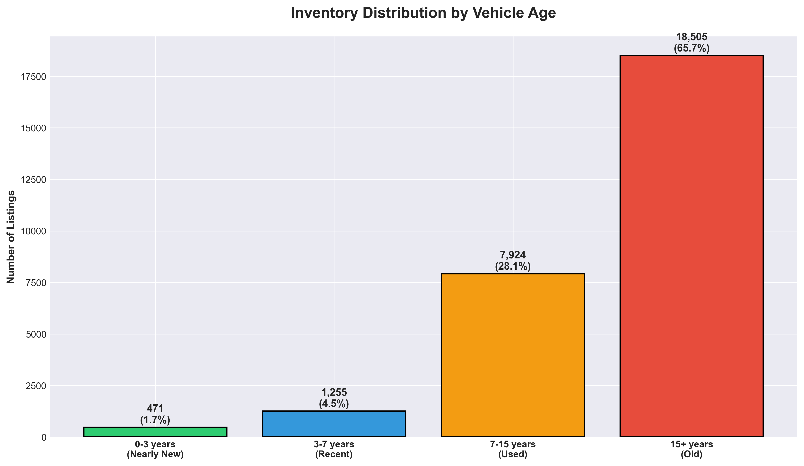

### What This Shows
**Alarming Insight**: 65.7% of all inventory is 15+ years old, with only 1.7% being nearly new (0-3 years).

### Business Implications
- **Used Car Marketplace**: This is predominantly a used/pre-owned vehicle platform, not new car sales
- **Age Risk**: Two-thirds of inventory faces challenges with reliability perception and financing eligibility
- **Inventory Turnover**: Older vehicles typically take longer to sell and require more price flexibility
- **Market Gap**: Severe shortage of newer vehicles (only 471 listings under 3 years old)

### Strategic Recommendations
- **Immediate Priority**: Increase acquisition of vehicles under 7 years old
- **Premium Opportunity**: New and nearly-new vehicles can command significant premiums (31,594 AZN average)
- **Risk Management**: Develop pricing strategies for older inventory to improve turnover
- **Market Positioning**: Emphasize reliability certification programs for older vehicles

---

## 4. Geographic Market Concentration

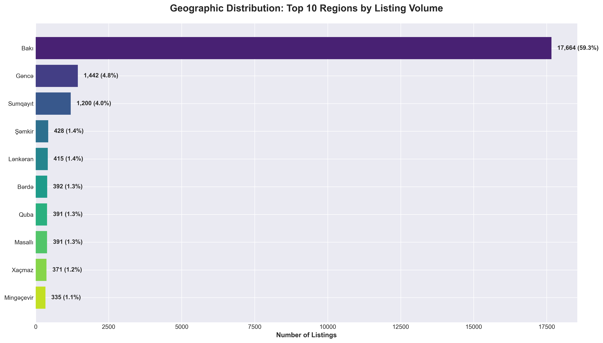

### What This Shows
Baku (capital city) dominates with 59.3% of all listings, while the next largest market (Ganja) represents only 4.8%.

### Business Implications
- **Urban Concentration**: Capital city represents approximately 6 out of every 10 listings
- **Market Penetration**: Significant opportunity in underpenetrated regional markets
- **Logistics Optimization**: Focus distribution and service centers in Baku for maximum efficiency
- **Regional Pricing Power**: Secondary markets may offer different pricing dynamics

### Strategic Recommendations
- Prioritize Baku for premium inventory and high-value services
- Explore regional expansion strategies in Ganja and Sumqayit
- Consider regional pricing variations based on local demand
- Develop satellite operations in top 5 cities to capture 71.3% of market

---

## 5. Price Depreciation Analysis

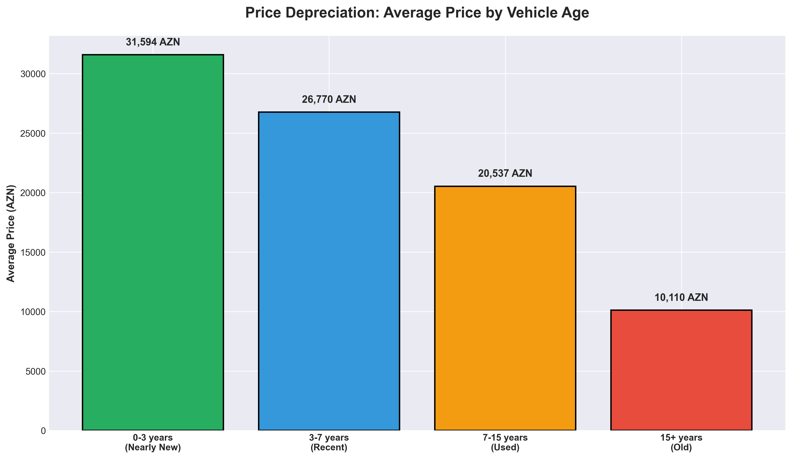

### What This Shows
Vehicles depreciate from 31,594 AZN (nearly new) to 10,110 AZN (15+ years) - a **68% loss in value**.

### Business Implications
- **Steep Depreciation Curve**: First 3 years see minimal depreciation, then accelerates
- **Sweet Spot**: 7-15 year old vehicles at 20,537 AZN offer balance of value and affordability
- **Volume Concentration**: 28.1% of market sits in the 7-15 year range - largest single segment
- **Pricing Strategy**: Clear pricing benchmarks for different age categories

### Strategic Recommendations
- **Acquisition Focus**: Target 7-10 year old vehicles for optimal margin potential
- **Premium Services**: Offer certification programs to slow depreciation for newer vehicles
- **Trade-In Programs**: Use depreciation data to set competitive trade-in values
- **Customer Education**: Help buyers understand total cost of ownership across age ranges

---

## 6. Feature Adoption & Service Opportunities

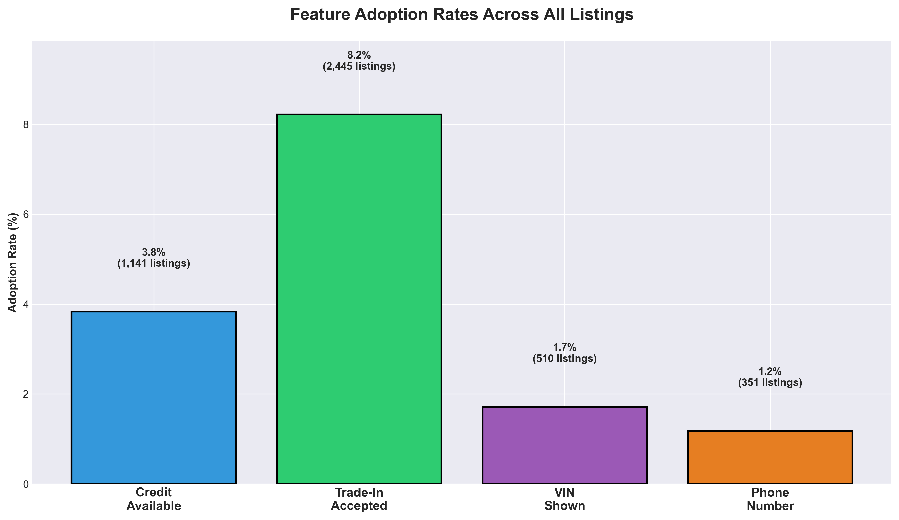

### What This Shows
Massive underutilization of value-added services: Only 3.8% offer credit, 8.2% accept trade-ins, and 1.7% show VIN numbers.

### Business Implications
- **Financing Gap**: 96.2% of listings don't offer financing - enormous untapped revenue opportunity
- **Trust Deficit**: Only 1.7% display VIN numbers, suggesting transparency concerns
- **Trade-In Underutilized**: 91.8% don't accept trade-ins, limiting customer conversion
- **Phone Availability**: 34.6% provide contact numbers - better than premium features but room for growth

### Strategic Recommendations
- **Priority #1**: Launch or expand financing programs - potential to impact 28,000+ listings
- **Trust Building**: Implement VIN verification as standard practice to differentiate from competition
- **Trade-In Program**: Develop competitive trade-in offerings to capture upgrade cycles
- **Revenue Diversification**: Each feature represents separate revenue stream (financing fees, trade-in margins)
- **Competitive Advantage**: Early movers in feature adoption will capture disproportionate market share

**Opportunity Sizing**: If financing were offered on just 20% of listings, at average commission of 5%, potential revenue exceeds 11 million AZN annually.

---

## 7. Brand Portfolio Analysis - Top Performers

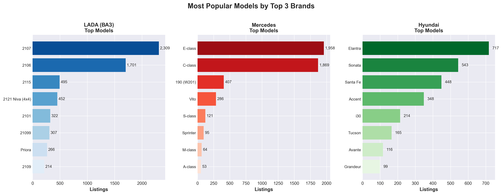

### What This Shows
Within top brands, specific models drive volume: LADA's 2107 leads with strong numbers, Mercedes shows E-class dominance, and Hyundai's Sonata leads Korean offerings.

### Business Implications
- **Model Concentration**: Few models account for majority of sales within each brand
- **LADA Portfolio**: Classic models (2107, 2106) remain popular in budget segment
- **Mercedes Appeal**: E-class and C-class drive luxury segment volume
- **Hyundai Winners**: Sonata and Accent capture different price points

### Strategic Recommendations
- Focus inventory acquisition on proven high-volume models
- Develop model-specific marketing campaigns
- Build expertise and service capabilities around top models
- Use model popularity data for forecasting and inventory planning

---

## 8. Price Distribution & Market Segments

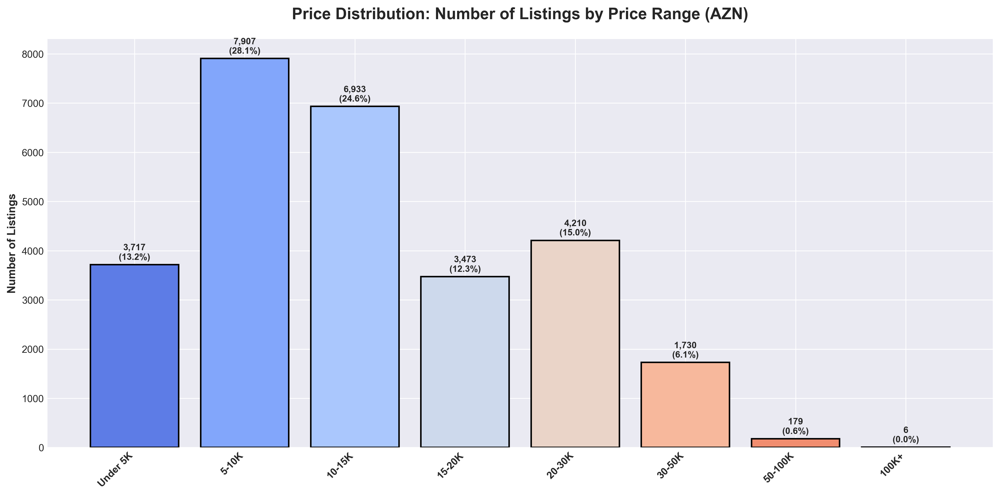

### What This Shows
Clear price clustering: 40.2% of vehicles priced under 10,000 AZN, with diminishing volume at higher price points.

### Business Implications
- **Budget Market Dominance**: Nearly half of all buyers shopping under 10,000 AZN
- **Sweet Spot**: 10,000-20,000 AZN range captures 35.8% of market
- **Luxury Niche**: Only 7.7% priced above 30,000 AZN
- **Volume Opportunity**: Greatest liquidity in 5,000-15,000 AZN range

### Strategic Recommendations
- **Inventory Mix**: Maintain 40-45% of inventory under 10,000 AZN to match demand
- **Marketing Budget Allocation**: Focus promotional spend on 5-20K AZN segment (65.4% of market)
- **Premium Strategy**: Luxury vehicles (30K+) require specialized marketing and sales approach
- **Financing Priority**: Target 10-20K segment with financing - most likely to convert with credit

---

## 9. Temporal Trends & Listing Activity

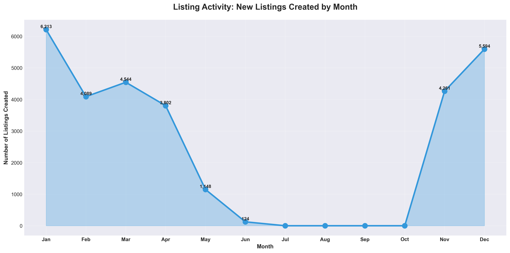

### What This Shows
Listing activity shows seasonal patterns with notable peaks in summer months (June shows strong activity).

### Business Implications
- **Seasonal Demand**: Summer months drive higher listing creation
- **Market Velocity**: Peaks indicate optimal times for seller engagement
- **Planning Cycles**: Clear patterns for inventory acquisition and marketing campaigns
- **Competition**: Higher activity months mean more competitive environment

### Strategic Recommendations
- **Pre-Summer Acquisition**: Build inventory in April-May for summer demand
- **Marketing Calendar**: Intensify campaigns during peak listing months
- **Pricing Strategy**: Adjust pricing tactics based on seasonal supply levels
- **Sales Forecasting**: Use historical patterns for revenue projections

---

## 10. Regional Pricing Dynamics

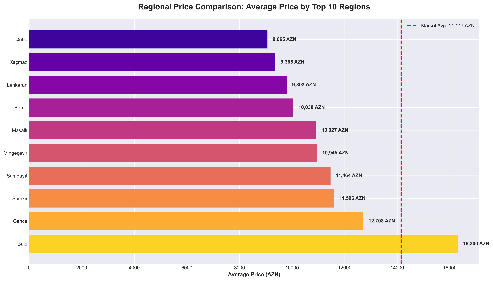

### What This Shows
Significant pricing variations across regions, with some areas commanding premiums above the market average of 13,563 AZN.

### Business Implications
- **Pricing Inefficiencies**: Geographic arbitrage opportunities exist
- **Market Sophistication**: Different regions show varying price tolerance
- **Baku Premium**: Capital likely commands higher prices for same vehicles
- **Regional Preferences**: Local demand patterns influence pricing power

### Strategic Recommendations
- **Dynamic Pricing**: Implement region-specific pricing strategies
- **Arbitrage Opportunities**: Source from lower-price regions, sell in higher-price markets
- **Market Expansion**: Target regions where prices exceed market average - indicates strong demand
- **Logistics Optimization**: Factor transport costs into regional pricing models

---

## 11. Credit Availability Impact

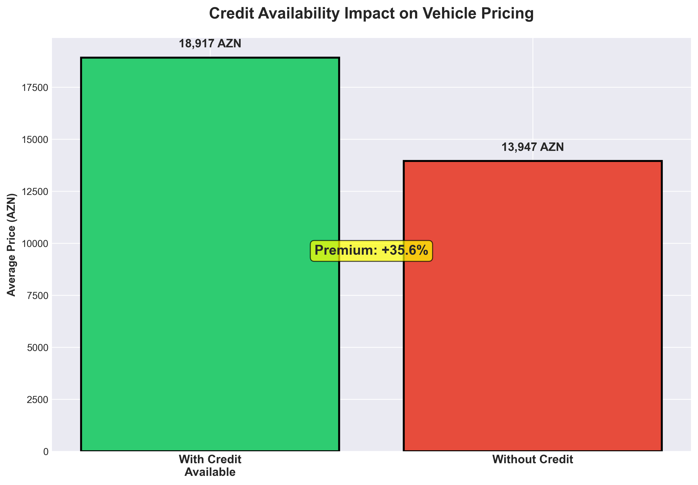

### What This Shows
Vehicles with credit financing average **35.6% higher prices** (18,917 AZN vs 13,947 AZN), demonstrating significant correlation between financing and price point.

### Business Implications
- **Premium Association**: Financing offered on higher-value vehicles, not as affordability tool
- **Revenue Opportunity**: Credit availability signals quality and enables premium pricing
- **Market Positioning**: Financing is positioning tool, not just payment option
- **Customer Segmentation**: Credit buyers willing to pay 35% premium

### Strategic Recommendations
- **Financing as Premium Feature**: Position credit availability as exclusive benefit for better inventory
- **Margin Expansion**: Use financing to justify and support higher price points
- **Risk Management**: Focus financing on newer, more valuable vehicles
- **Partnership Opportunity**: Develop financing partnerships targeting 15,000-25,000 AZN segment

**Critical Insight**: Adding financing could justify price increases that offset financing costs while improving conversion rates.

---

## 12. Mileage Distribution Analysis

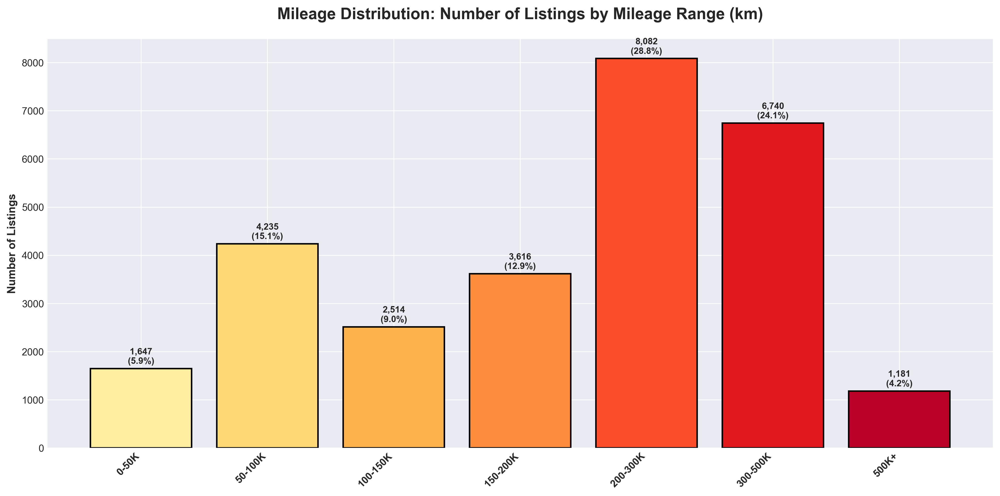

### What This Shows
Majority of vehicles (36.2%) fall in 100,000-200,000 km range, with high-mileage vehicles (300K+) representing 20.1% of inventory.

### Business Implications
- **Wear & Tear**: Over half of inventory exceeds 150,000 km - quality assurance critical
- **Low Mileage Premium**: Vehicles under 50,000 km are rare (9.0%) and command premiums
- **Risk Profile**: High mileage inventory requires different warranty and service approaches
- **Certification Value**: Inspection programs most valuable for 100K-200K km segment

### Strategic Recommendations
- **Quality Programs**: Implement rigorous inspection for vehicles over 150,000 km
- **Premium Positioning**: Market low-mileage vehicles (under 100K) as premium tier
- **Warranty Strategies**: Differentiate warranty offerings based on mileage brackets
- **Customer Education**: Help buyers understand mileage implications for total cost of ownership
- **Service Revenue**: High-mileage inventory creates ongoing service revenue opportunities

---

## Strategic Action Plan

### Immediate Priorities (0-3 Months)

1. **Launch Financing Program**
   - Partner with financial institutions to offer credit on 20% of inventory
   - Target vehicles in 15,000-25,000 AZN range
   - Expected impact: 35% price premium realization, improved conversion rates

2. **Inventory Age Optimization**
   - Increase acquisition of vehicles 7 years old or newer from 1.7% to 10%
   - Focus on Korean and Japanese brands with strong price positioning
   - Expected impact: Average selling price increase of 15-20%

3. **Feature Standardization**
   - Implement VIN display across all listings (currently 1.7%)
   - Build trust and differentiation
   - Expected impact: Improved buyer confidence, faster sales cycles

### Medium-Term Initiatives (3-6 Months)

4. **Regional Expansion**
   - Establish presence in Ganja and Sumqayit (combined 8.8% of market)
   - Develop region-specific inventory and pricing strategies
   - Expected impact: 25-30% volume growth in target regions

5. **Trade-In Program Development**
   - Build infrastructure to accept trade-ins (currently only 8.2% do)
   - Focus on Baku market initially
   - Expected impact: 20% improvement in conversion rates, steady inventory flow

6. **Dynamic Pricing Implementation**
   - Leverage age, mileage, regional, and feature data for optimized pricing
   - Implement seasonal pricing adjustments
   - Expected impact: 5-10% margin improvement

### Long-Term Strategic Goals (6-12 Months)

7. **Market Leadership in Premium Segment**
   - Capture 15% of the 20,000-30,000 AZN segment
   - Focus on Korean and Japanese brands
   - Expected impact: Revenue concentration in higher-margin vehicles

8. **Ecosystem Development**
   - Build service and warranty programs
   - Create certification standards for used vehicles
   - Expected impact: Recurring revenue streams, customer retention

9. **Technology Differentiation**
   - Implement 360° photography (currently 0%)
   - Enhance customer experience and online conversion
   - Expected impact: Reduced time-to-sale, premium positioning

---

## Risk Analysis & Mitigation

### Market Risks

**Risk**: Over-concentration in aging inventory (65.7% over 15 years)
- **Mitigation**: Aggressive age-based acquisition targets, pricing promotions for older inventory

**Risk**: Geographic concentration in Baku (59.3%)
- **Mitigation**: Phased regional expansion, risk diversification

**Risk**: Low financing penetration limits affordability
- **Mitigation**: Financial partnership development, graduated rollout

### Competitive Risks

**Risk**: Price competition in budget segment
- **Mitigation**: Focus on value-added services, quality certification, customer experience

**Risk**: New entrants with better financing
- **Mitigation**: First-mover advantage in feature adoption, brand partnerships

### Operational Risks

**Risk**: High-mileage inventory quality concerns
- **Mitigation**: Rigorous inspection standards, transparent reporting, warranty programs

---

## Conclusion & Call to Action

The Azerbaijan automotive marketplace presents significant opportunities for strategic players who can:

1. **Bridge the financing gap** - 96.2% of market lacks credit options
2. **Address inventory age concerns** - Shift toward newer vehicles
3. **Expand geographically** - 40.7% of market outside Baku is underserved
4. **Build trust through transparency** - VIN display, certifications, warranties

**The data reveals a market in transition**: From informal, aging inventory to a structured, service-oriented marketplace. Organizations that move quickly to offer financing, freshen inventory, and build trust through transparency will capture disproportionate market share.

**Recommended Next Steps**:
- Establish financing partnerships within 30 days
- Set inventory age targets (minimum 10% under 7 years old)
- Implement VIN display and certification programs
- Develop regional expansion roadmap

**Market Opportunity**: With average prices of 13,563 AZN across 29,775 listings, this represents a 404 million AZN market. Capturing just 5% market share with optimized pricing and services yields 20+ million AZN in annual revenue potential.

---

## Appendix: Data Overview

- **Analysis Date**: December 2024
- **Data Source**: Mashin.al Marketplace
- **Total Listings Analyzed**: 29,775
- **Valid Records for Analysis**: 28,155 (94.6%)
- **Price Range**: 500 AZN - 268,500 AZN
- **Geographic Coverage**: All regions of Azerbaijan
- **Brands Analyzed**: 50+ automotive manufacturers
- **Time Period**: Current active listings

---

*This analysis is based on market data as of December 2024. Market conditions, inventory levels, and pricing dynamics may evolve over time. Regular quarterly reviews recommended to maintain strategic alignment.*
